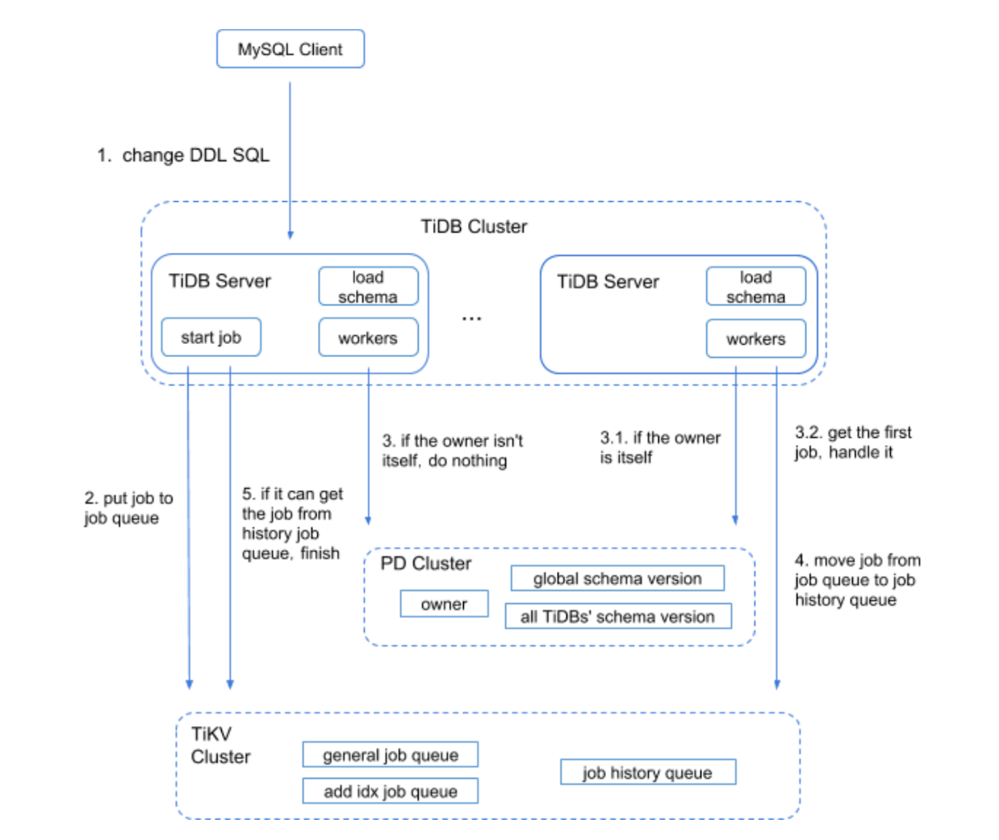

# 03 在线表结构变更（Online DDL）
> 高振娇  2020 年 2 月 20 日

## 一、背景

随着业务需求的不断变化，对生产环境中的表对象做 DDL 操作，是不可避免的操作。本文档将从 TiDB Online 的原理，性能调整，以及问题排查等方面来进行说明，帮助大家来完成 DDL 相关操作。

## 二、相关概念及原理解释

TiDB Oline DDL 的解决方案是 ---- [Google F1 的异步 Schema 变更算法](http://static.googleusercontent.com/media/research.google.com/zh-CN//pubs/archive/41376.pdf)。

F1 中的 Schema 变更是在线的、异步的，并且 Schema 变更过程中所有数据保持可用 ， 保持数据一致性，并最大限度减小对性能的影响。除此之外，TiDB 在 F1 算法的基础上做了一些简单的优化。创建表可以秒回，创建索引也是秒回，完成并生效的时间和表大小成正比。

### 2.1 在线变更的原理（如不关注原理可以跳过）

本章节介绍 TiDB SQL 层中处理异步 Schema 变更的流程。 下面将介绍每个模块以及基本的变更流程。更为详细的 DDL 的变更流程可以阅读博客 [DDL 源码解析](https://pingcap.com/blog-cn/tidb-source-code-reading-17/)。

1. MySQL Client 发送给 TiDB server 一个 DDL 操作请求。
1. 某个 TiDB server 收到请求（MySQL Protocol 层收到请求进行解析优化），然后到达 TiDB SQL 层进行执行。这步骤主要是在 TiDB SQL 层接到请求后，会起个 start job 的模块根据请求将其封装成特定的 DDL job，然后将此 job 按语句类型分类，分别存储到 KV 层的对应 DDL job 队列，并通知自身对应 worker 有 job 需要处理。
1. 接收到处理 job 通知的 worker，会判断自身是否处于 owner 的角色，如果是 owner 角色则直接处理此 job，如果没有处于此角色则退出不做任何处理。假设此 TiDB Server 不是此角色，那么其他的某个节点中肯定有一个是 owner。那个处于 owner 角色节点的 worker 通过定期检测机制来检查是否有 job 可以被执行。如果发现有 job ，那么 worker 就会处理。
1. 当 worker 处理完 job 后， 它会将此 job 从 KV 层对应的 job queue 中移除，并放入 job history queue。之前封装 job 的 start job 模块会定期去 job history queue 查看是否有之前放进去的 job 对应 ID 的 job，如果有则整个 DDL 操作结束。
1. TiDB Server 将 response 返回 MySQL Client。

DDL 在执行过程中会有引入多个状态变更。以 Add Index 为例，整个变更状态如下：

> absent -> delete only -> write only -> write reorg -> public

## 三、查询 DDL 相关状态、进度的命令介绍

### 3.1 ADMIN SHOW DDL

用于查看 TiDB 自身的状态，并对 TiDB 中的表数据进行校验。

### 3.2 ADMIN SHOW DDL JOBS

查看集群环境中的 DDL 任务运行中详细的状态。

* JOB_ID：每个 DDL 操作对应一个 DDL 作业，JOB_ID 全局唯一。
* DB_NAME：执行 DDL 操作的数据库的名称。
* TABLE_NAME：执行 DDL 操作的表的名称。
* JOB_TYPE：DDL 操作的类型。
* SCHEMA_STATE：schema 的当前状态。如果 JOB_TYPE 是 add index，则为 index 的状态；如果是 add column，则为 column 的状态，如果是 create table，则为 table 的状态。常见的状态有以下几种：

  * none：表示不存在。一般 drop 操作或者 create 操作失败回滚后，会变为 none 状态。

  * delete only、write only、delete reorganization、write reorganization：这四种状态是中间状态，在 Online, Asynchronous Schema Change in F1 论文中有详细说明，在此不再赘述。由于中间状态转换很快，一般操作中看不到这几种状态，只有执行 add index 操作时能看到处于 write reorganization 状态，表示正在添加索引数据。

  * public：表示存在且可用。一般 create table 和 add index/column 等操作完成后，会变为 public 状态，表示新建的 table/column/index 可以正常读写了。

* SCHEMA_ID：执行 DDL 操作的数据库的 ID。
* TABLE_ID：执行 DDL 操作的表的 ID。
* ROW_COUNT：执行 add index 操作时，当前已经添加完成的数据行数。
  * START_TIME：DDL 操作的开始时间。
* STATE：DDL 操作的状态。常见的状态有以下几种：

  * none：表示该操作任务已经进入 DDL 作业队列中，但尚未执行，因为还在排队等待前面的 DDL 作业完成。另一种原因可能是执行 drop 操作后，会变为 none 状态，但是很快会更新为 synced 状态，表示所有 TiDB 实例都已经同步到该状态。

  * running：表示该操作正在执行。

  * synced：表示该操作已经执行成功，且所有 TiDB 实例都已经同步该状态。

  * rollback done：表示该操作执行失败，回滚完成。

  * rollingback：表示该操作执行失败，正在回滚。

  * cancelling：表示正在取消该操作。这个状态只有在用 ADMIN CANCEL DDL JOBS 命令取消 DDL 作业时才会出现。

### 3.3 ADMIN SHOW DDL JOB QUERIES job_id [, job_id]

用于查看 job_id 对应的 DDL 任务的原始 SQL 语句。

## 四、执行 DDL 前调整参数

### 4.1 在 Add Index 时，write reorg 阶段会回填数据，回填数据的速度通过 2 个参数控制。

* **tidb_ddl_reorg_worker_cnt** 该参数用来设置 DDL reorg worker 的数量，控制回填的并发度。

    作用域: GLOBAL，默认值 4（3.0.3 版本起）。

* **tidb_ddl_reorg_batch_size** 控制回填的数据量。这个变量用来设置 DDL 操作 re-organize 阶段的 batch size。比如 Add Index 操作，需要回填索引数据，通过并发 tidb_ddl_reorg_worker_cnt 个 worker 一起回填数据，每个 worker 以 batch 为单位进行回填。如果 Add Index 时有较多 Update 操作或者 Replace 等更新操作，batch size 越大，事务冲突的概率也会越大，此时建议调小 batch size 的值，最小值是 32。在没有事务冲突的情况下，batch size 可设为较大值，最大值是 10240，这样回填数据的速度更快，但是 TiKV 的写入压力也会变大。

    作用域: GLOBAL，默认值 256（3.0.3 版本起）。

### 4.2 线上推荐值
通过我们实际测试经验，通常：

1. 在无其他负载情况下，想让 Add Index  尽快完成，可以将 tidb_ddl_reorg_worker_cnt 和 tidb_ddl_reorg_batch_size 适当调大，比如 20，2048。

2. 在有其他负载情况下，想让 add index 尽量不影响其他业务，可以将 tidb_ddl_reorg_worker_cnt 和 tidb_ddl_reorg_batch_size 适当调小，比如 4, 256。

> 2 个参数均可以在 DDL 任务执行过程中动态调整，并且在下一个 batch 生效。

## 五、注意事项

* 请根据 DDL 操作的类型，并结合业务负载压力，选择合适的时间点执行，如 add index 操作建议在业务负载比较低的情况运行。
* 由于添加索引时间跨度较长，发送相关的指令后，会在后台执行，TiDB Server 挂掉不会影响继续执行。

## 六、操作后 Check 项

### 6.1 确认任务执行状态

使用下述命令来确认 DDL 任务的执行状态以及进度：

* ADMIN SHOW DDL
* ADMIN SHOW DDL JOBS

> 在查看 DDL 的执行进度，尤其是 Add Index 时：
> 1. SCHEMA_STATE 字段来查看 schema 的当前状态。
> 1. ROW_COUNT 来确定当前已经添加完成的数据行数。

* ADMIN SHOW DDL JOB QUERIES job_id [, job_id]

### 6.2 检查读写性能

在添加索引时，回填数据阶段会对集群造成一定的读写压力，add index 的命令发送成功后，并且在 write reorg 阶段，建议检查 Grafana 中 TiDB 和 TiKV 读写相关的性能指标，以及业务响应时间，来确定 add index 操作对集群是否造成影响。

## 七、常见问题

### 7.1 各类 DDL 操作预估耗时

在 DDL 操作没有阻塞，各个 TiDB Server 能够正常更新 Schema 版本的情况下，以及 DDL  Owner 节点正常运行的情况下，各类 DDL 操作的预估耗时如下：

| 操作类型 | 预估耗时 |
| :- | :- |
| create database / table | 1s 左右 |
| drop database / table | 1s 左右 |
| truncate table | 1s 左右 |
| alter table add / drop / modify column | 1s 左右 |
| drop index | 1s 左右 |
| add index | 取决于数据量、系统负载、 DDL 参数的设置 |

> 注：以上为各类操作的预估耗时，请以实际操作耗时为准。

### 7.2 执行 DDL 会慢的可能原因

* 多个 DDL 语句一起执行的时候，后面的几个 DDL 语句可能会比较慢，因为需要排队等待
* 在正常集群启动后，第一个 DDL 操作的执行时间可能会比较久，可能是 DDL 在做 owner 的选举
* 由于停 TiDB 时不能与 PD 正常通信（包括停电情况）或者用 kill -9 指令停 TiDB 导致 TiDB 没有及时从 PD 清理注册数据
* 当集群中某个 TiDB 与 PD 或者 TiKV 之间发生通信问题，即 TiDB 不能及时获取最新版本信息
  
### 7.3 触发 Information schema is changed 错误的原因

TiDB 在执行 SQL 语句时，会使用当时的 schema 来处理该 SQL 语句，而且 TiDB 支持在线异步变更 DDL。那么，在执行 DML 的时候可能有 DDL 语句也在执行，而你需要确保每个 SQL 语句在同一个 schema 上执行。所以当执行 DML 时，遇到正在执行中的 DDL 操作就可能会报 Information schema is changed 的错误。为了避免太多的 DML 语句报错，已做了一些优化。
现在会报此错的可能原因如下（后两个报错原因与表无关）：

* 执行的 DML 语句中涉及的表和集群中正在执行的 DDL 的表有相同的，那么这个 DML 语句就会报此错。
* 这个 DML 执行时间很久，而这段时间内执行了很多 DDL 语句，导致中间 schema 版本变更次数超过 1024（v3.0.5 版本之前此值为定值 100。v3.0.5 及之后版本默认值为 1024，可以通过 tidb_max_delta_schema_count 变量修改）。
* 接受 DML 请求的 TiDB 长时间不能加载到 schema information（TiDB 与 PD 或 TiKV 之间的网络连接故障等会导致此问题），而这段时间内执行了很多 DDL 语句，导致中间 schema 版本变更次数超过 100。

    > 目前 TiDB 未缓存所有的 schema 版本信息。
    >
    > 对于每个 DDL 操作，schema 版本变更的数量与对应 schema state 变更的次数一致。
    >
    > 不同的 DDL 操作版本变更次数不一样。例如，create table 操作会有 1 次 schema 版本变更；
    > add column 操作有 4 次 schema 版本变更。

### 7.4 触发 Information schema is out of date 错误的原因

当执行 DML 时，TiDB 超过一个 DDL lease 时间（默认 45s）没能加载到最新的 schema 就可能会报 Information schema is out of date 的错误。遇到此错的可能原因如下：

* 执行此 DML 的 TiDB 被 kill 后准备退出，且此 DML 对应的事务执行时间超过一个 DDL lease，在事务提交时会报这个错误。

* TiDB 在执行此 DML 时，有一段时间内连不上 PD 或者 TiKV，导致 TiDB 超过一个 DDL lease 时间没有 load schema，或者 TiDB 断开了与 PD 之间带 keep alive 设置的连接。

### 7.5 高并发情况下执行 DDL 时报错的原因

高并发情况下执行 DDL（比如批量建表）时，极少部分 DDL 可能会由于并发执行时 key 冲突而执行失败。
并发执行 DDL 时，建议将 DDL 数量保持在 20 以下，否则你需要在应用端重试失败的 DDL 语句。

